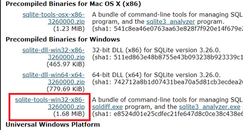

sqldiff_with_pass
=========

## Overview
The sqlite3 offical diff tool (sqldiff.exe) is not support database with password.  
sqldiff_with_pass is command line diff tool for sqlite3 database with password.

## Setup
1. Please download the command-line tools including "sqldiff.exe" from the following URL, and unzip C drive directly under.  
[SQLite Download Page](https://www.sqlite.org/download.html)  
 
1. Please download the "System.Data.SQLite.dll" from the following URL according to operating environment.  
[System.Data.SQLite: Downloads Page](http://system.data.sqlite.org/index.html/doc/trunk/www/downloads.wiki)  
## Usage
```
$ Add-Type -Path System.Data.SQLite.dll
$ sqldiff_with_pass.ps1 [DB1] [DB2] [PASSWORD]
$ sqldiff_with_pass.ps1 [DB1] [DB2] [PASSWORD] [PASSWORD2]
```